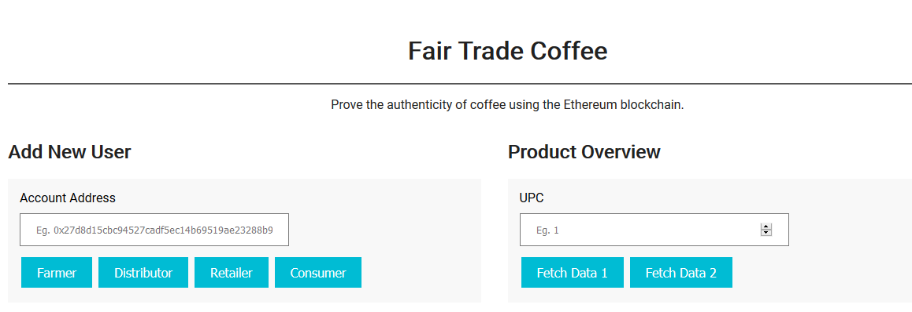
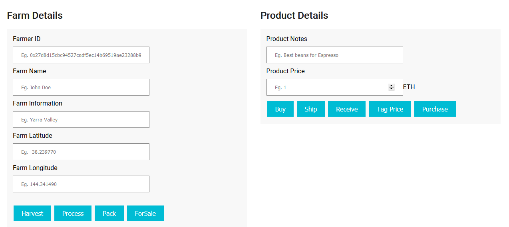

# Ethereum Dapp for Tracking Items through Supply Chain

For this project, I created a DApp supply chain solution backed by the Ethereum platform. I will architect smart contracts that manage specific user permission controls as well as contracts that track and verify a product’s authenticity.

## Getting Started
The case taken in consideration is related to the harvesting, processing and selling of coffee.

Following the example of the Starter Code provided by Udacity at the following [link](https://github.com/udacity/nd1309-Project-6b-Example-Template).

###Project UML
Below there are the UML diagrams related to the processes covered by the following DApp:


###Info for submit

* TX: 0x17fe68fc7cded20fc716ecbc41ab2c09eb12af01daca92141c33ef6b9e9c0f83
* Contract Address: 0xe9456C9a2d9061cA4c55ca6b3Ef98c3Ef6c1c69d 
* Program version: 1.0.0
* Node version: v12.16.1
* Truffle version: v4.1.14
* web3 version: v1.2.1

### Role

* Farmer: harvest, processes, packs and sells coffee to the distributor. It is assumed that the distributor takes the coffee without the need for a shipment
* Distributor: buys the coffee from the farmer and sends it to the vendors in his chain
* Retailer: He receives the goods from the distributor, assigns a new price and retails them to his customers
* Consumer: Buy coffee!

## Tests

There are 12 tests, one for each allowed action and one for assigning roles by the contract owner to other accounts.

```
it("Testing smart contract function addRole(address account) for assigning roles ", async () => {
        const supplyChain = await SupplyChain.deployed();

        let result = await supplyChain.addDistributor(distributorID);
        assert.equal(result.logs[0].event, "DistributorAdded"); //asserts that the event has been emitted
        result = await supplyChain.addRetailer(retailerID);
        assert.equal(result.logs[0].event, "RetailerAdded"); //asserts that the event has been emitted
        result = await supplyChain.addConsumer(consumerID);
        assert.equal(result.logs[0].event, "ConsumerAdded"); //asserts that the event has been emitted
        result = await supplyChain.addFarmer(farmerID);
        assert.equal(result.logs[0].event, "FarmerAdded"); //asserts that the event has been emitted
});
```

### Front-End

Through the frontend it is possible to add permissions or create new users and perform all the operations of the chain. It also provides a summary of the operations performed and a log of the objects. Each button has a tooltip.





## Built With

* [Ethereum](https://www.ethereum.org/) - Ethereum is a decentralized platform that runs smart contracts
* [Truffle Framework](http://truffleframework.com/) - Truffle is the most popular development framework for Ethereum with a mission to make your life a whole lot easier.

## Versioning

Actual version: 1.0.0

## Authors

* **[Mattia-Code](https://github.com/Mattia-code)**

## Acknowledgments

* Solidity
* Ganache-cli
* Truffle

###Note

```
truffle migrate --reset --network rinkeby
```

